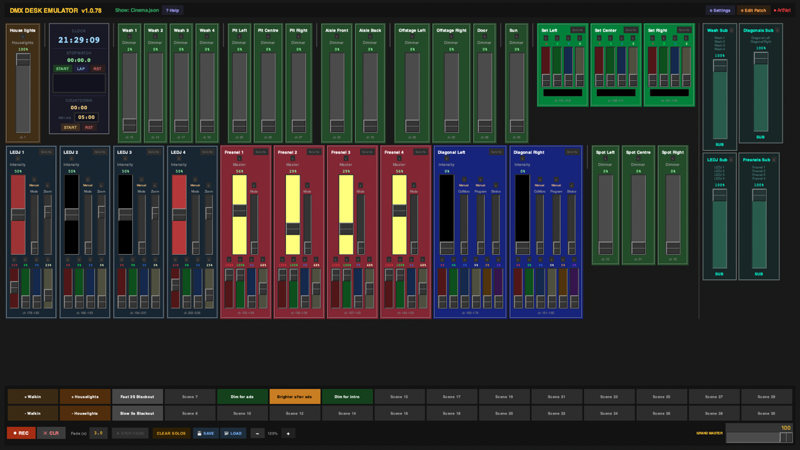

# DMX Desk Emulator

A software lighting desk for macOS that outputs DMX over Art-Net UDP. Built for small to medium theatres as a volunteer-friendly alternative to hardware lighting desks or the QLab lighting dashboard.



## Features

- **Universal fixture support** — dimmers, RGB, RGBW, RGBWA-UV, multi-channel intelligent fixtures, and relay/digital fixtures (on/off toggle buttons)
- **30 scene memories** with per-scene fade times, names, and colour coding
- **Fade control** — smooth interpolation with a STOP FADE button to interrupt at any point
- **Submasters** — group fixtures and scale them together
- **Grand Master** — global output scale
- **Solo & partial recording** — record individual channels into scenes
- **Copy & paste** fixture states between compatible fixtures
- **Group selection** — shift-click to gang fixtures, with smooth 1-second alignment fade
- **Built-in clock, stopwatch and countdown timer**
- **Full patch editor** with multi-select, drag reorder, and built-in fixture definition editor
- **Open Fixture Library integration** — search and import from ~6000 fixtures
- **QLab OSC integration** — recall scenes by slot number or name from QLab cues
- **Art-Net indicator** with background ping to confirm node reachability
- **Auto-save** — scenes save automatically to the loaded show file
- **Reload last show** on startup option
- **Prevents display sleep** while running (macOS and Windows)

## Requirements

- macOS 10.14+ (primary platform) or Windows with Python
- Python 3.10+
- tkinter (included with Python on macOS)
- No other dependencies for core functionality

Optional (for PDF manual generation):
```
pip install reportlab
```

## Installation

1. Clone or download this repository
2. Copy `patch.json.example` to `patch.json` and edit for your rig
3. Run:

```bash
python3 desk.py
```

Or build a standalone macOS app:

```bash
pip install py2app
bash build_app.sh
```

## Quick Start

### 1. Set up your patch

Edit `patch.json` to describe your fixtures. Each entry specifies the fixture type, name, DMX address and which row to display it in:

```json
[
  {"type": "dimmer",  "name": "House Lights", "address": 1,  "row": 1},
  {"type": "rgb",     "name": "Wash 1",       "address": 2,  "row": 1},
  {"type": "dimmer",  "name": "Spot SR",      "address": 5,  "row": 2},
  {"type": "submaster","name": "Wash Sub",    "targets": ["Wash 1", "Wash 2"], "row": 1}
]
```

Built-in fixture types: `dimmer`, `rgb`, `rgbw`. Custom types are defined in `fixtures/<type>.json`.

### 2. Configure Art-Net

Open **⚙ Settings** and set the target IP address of your Art-Net node, port (default 6454) and universe (default 0).

### 3. Record scenes

Set your levels using the faders, then click **⏺ REC** to store the current state into the selected scene button. Name scenes by right double-clicking a button.

### 4. Recall scenes

Click a scene button to recall it. If a fade time is set the levels interpolate smoothly.

## File Structure

```
desk.py                  — main application
patch.json               — fixture patch (your rig)
patch_scenes.json        — default scenes file
desk_prefs.json          — window position and settings (auto-created)
ofl_fixtures.json        — Open Fixture Library cache (auto-created)
fixtures/                — fixture definition files
  dimmer.json            — built-in dimmer
  rgb.json               — built-in RGB
  rgbw.json              — built-in RGBW
  <your_fixture>.json    — custom fixtures
shows/                   — show scene files
  my_show.json
monitor.py               — Art-Net monitor with HTP merge (testing tool)
make_manual.py           — generates PDF manuals
DMX_Desk_Manual.pdf      — full user manual
DMX_Desk_Quick_Reference.pdf  — one-page quick reference
build_app.sh             — builds macOS .app bundle
setup.py                 — py2app configuration
```

## Custom Fixture Definitions

Create a JSON file in `fixtures/` named after the fixture type:

```json
{
  "colour": "#2b2b4a",
  "channels": [
    {"label": "Master", "master": true,  "default": 0, "range": [0, 255], "unit": "%",  "show": true},
    {"label": "R",      "master": false, "default": 0, "range": [0, 255], "unit": "%",  "show": true},
    {"label": "G",      "master": false, "default": 0, "range": [0, 255], "unit": "%",  "show": true},
    {"label": "B",      "master": false, "default": 0, "range": [0, 255], "unit": "%",  "show": true},
    {"label": "Mode",   "master": false, "default": 0,
     "range": {"0-85": "Sound", "86-170": "Auto", "171-255": "Manual"},
     "unit": "named", "show": true}
  ]
}
```

For relay/digital fixtures (all channels are binary On/Off), the app automatically shows toggle buttons instead of faders. Add `"layout": "vertical"` for a vertical strip layout.

## QLab Integration

The desk includes an OSC listener (default port 8000) so QLab can recall scenes automatically during a show.

In QLab: Settings → Network → add destination (OSC, your desk Mac IP, port 8000, UDP).

Then add Network cues to your cue list:

| OSC Message | Effect |
|---|---|
| `/desk/scene/recall 3` | Recall scene slot 3 |
| `/desk/scene/recall "House Lights"` | Recall by scene name |
| `/desk/scene/recall/House_Lights` | Recall by name (underscores = spaces) |
| `/desk/scene/go` | Fire currently selected scene |
| `/desk/grandmaster 80` | Set Grand Master to 80% |
| `/desk/fader/Wash1 75` | Set fixture master to 75% |

Combine with Art-Net HTP merge at your node so both QLab and the desk can send simultaneously — the highest value per channel wins.

## Art-Net Monitor

`monitor.py` is a terminal-based Art-Net monitor with HTP merge, useful for testing without a node connected:

```bash
python3 monitor.py                  # listen on default port/universe
python3 monitor.py --no-merge       # last-packet-wins mode
python3 monitor.py --threshold 5    # only show channels above 5
```

## Show Workflow

1. **Program** all lighting looks as scenes in the desk
2. **In QLab**, add an OSC Network cue alongside each lighting cue: `/desk/scene/recall "Scene Name"`
3. **During the show**, QLab fires scenes automatically while the operator can adjust any fader live at any time
4. **Multiple shows** — save a separate `.json` file per production in the `shows/` folder. Load the correct file at the start of each show

## Contributing

Contributions welcome. Please open an issue before making large changes.

## Licence

MIT Licence — see LICENSE file.
